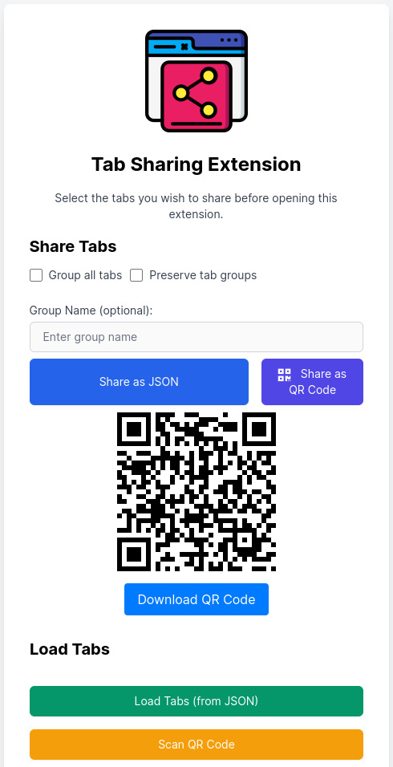

# TabShare

Easily share multiple links and keep them organized with the TabShare Chrome Extension - now featuring QR Code support!


[Get it on the Chrome Web Store](https://chrome.google.com/webstore/detail/tabshare/ojddpkfajpkclolheliiimohojdcbgjf)

## Description

TabShare is an innovative Chrome extension designed to make sharing and organizing
multiple links not only effortless but also enjoyable. Whether you're collaborating on a
project, sharing fascinating articles with friends, or researching options for your next
purchase, TabShare takes the process of sharing and opening multiple tabs to the next
level.

Say goodbye to the tedious task of copying and pasting links one by one. With TabShare,
you can share and open all your links at once, saving you precious time and hassle. And
now, with QR Code support, sharing and loading multiple tabs has never been easier!

## Features

- Select multiple tabs to share with just a few clicks
- Organize shared tabs into groups
- Import `tabShare` files or scan QR Codes to load tabs automatically
- Create a `tabShare` file manually for greater customization
- Seamlessly works with Chrome's tab groups feature
- Generate QR Codes for easy sharing

## How to Use

1. Open the TabShare extension window.
2. Hold down the SHIFT or CONTROL key and select the tabs you want to share.
3. Choose whether you want to group the tabs or not, and name the group if necessary.
4. You can also choose to preserve the current groups of your selected tabs.
5. Click "Share selected tabs". A `tabShare.json` file will be downloaded, or a QR Code will be generated.
6. Share the downloaded file or QR Code with someone who also has the TabShare extension installed.

Make sure the URLs from your tabs are valid ones and/or can be accessed via HTTP or HTTPS
protocols. For example, "chrome://extensions/" is not a valid HTTP URL.

## Manual File Creation

You can also create a `tabShare` file manually for greater customization. When creating
the file, use the reserved keyword "_NO_GROUP" as the group name if you want the tabs to
open outside of a group.

```json
{
  "groups": [
    {
      "name": "_no_group",
      "tabs": [ "http://www.myurl.com" ]
    }
  ]
}
```

## UI Screenshots





## Future ideas

We're exploring the idea of shipping apps or products with a TabShare
token/file/shortlink, making it easy for users to open a collection of relevant tabs
organized by groups with every link, resource, and material they need to get started!

## Contributing

TabShare was initially created to solve a specific problem in the simplest way possible,
using vanilla Javascript. We hope to keep things simple unless there's a compelling reason
to adopt a framework like React or Vue.

We welcome ideas and contributions on how to improve the user experience and UI, and we're
excited to see how the community can help shape the future of TabShare!

## Build and Load Locally

If you want to build and load the TabShare extension locally, follow these simple steps:

1. Clone or download the repository to your local machine.

```bash
git clone https://github.com/yourusername/tabshare.git
```
2. Open Google Chrome and navigate to chrome://extensions/.
3. Enable 'Developer mode' by toggling the switch in the top-right corner of the Extensions page.
4. Click on the 'Load unpacked' button and select the directory containing the downloaded repository.

The TabShare extension should now be loaded into your Chrome browser, and you can use it
as you would with the version from the Chrome Web Store.

Remember to pull any updates from the repository and reload the extension in the
chrome://extensions/ page to get the latest features and bug fixes.

Make sure to replace "yourusername" in the `git clone` command with your actual GitHub
username. This addition will guide users on how to build and load the TabShare extension
locally.

## Credits

TabShare icons made by Smashicons from www.flaticon.com.
